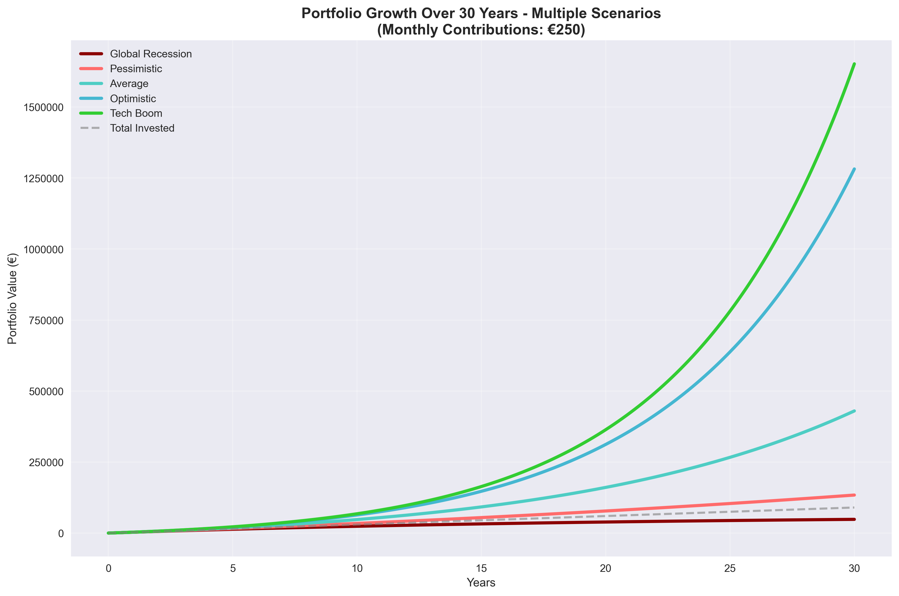
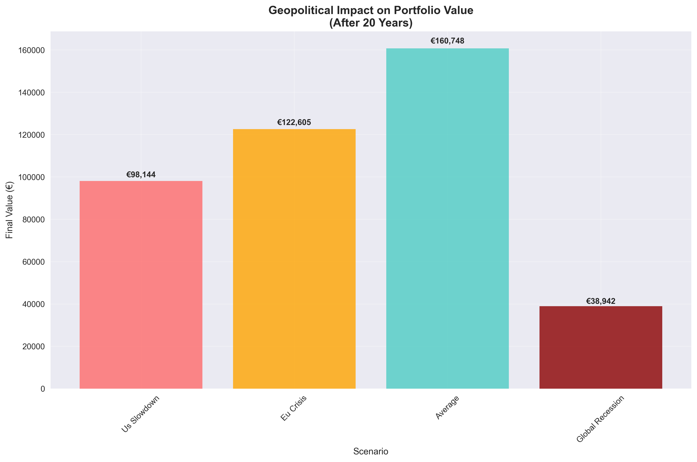
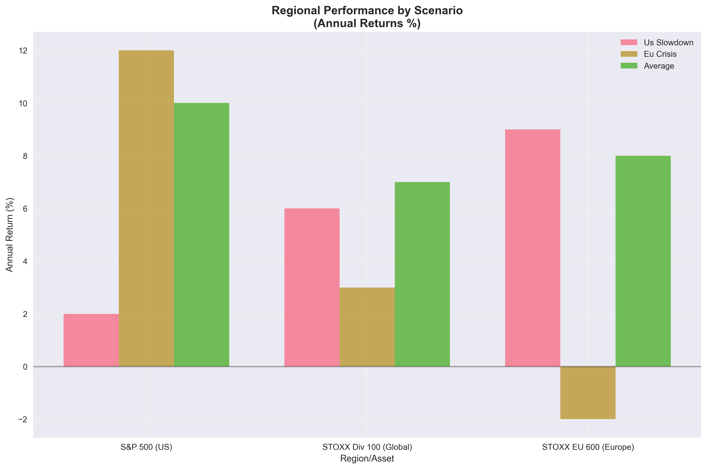
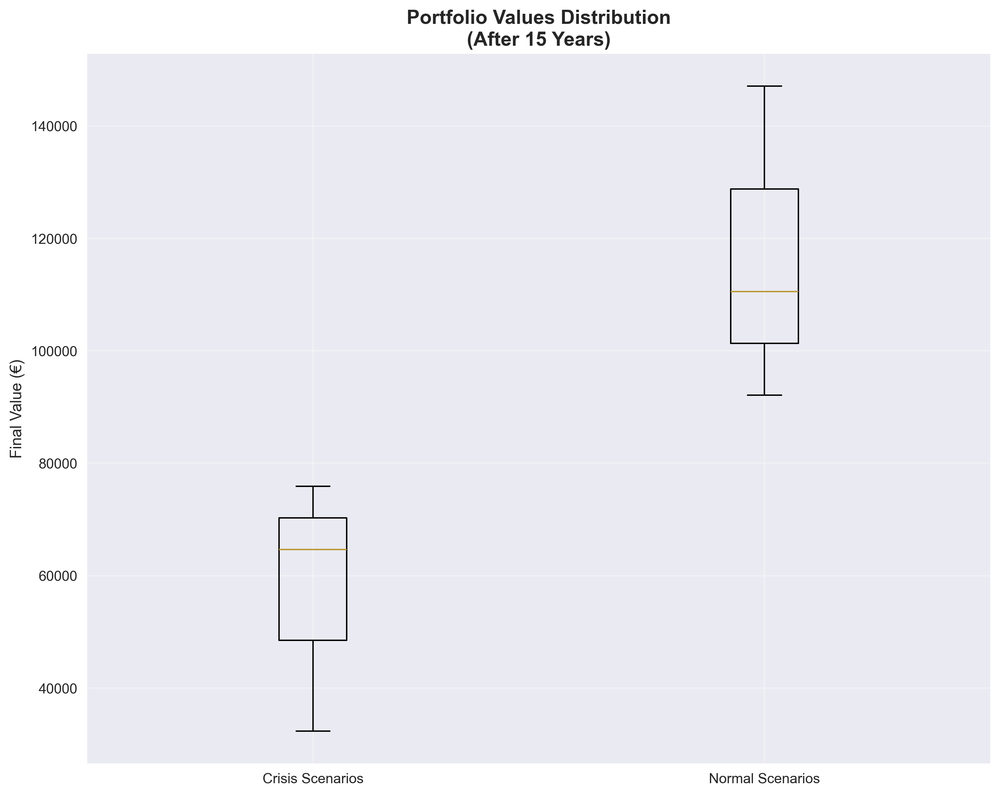
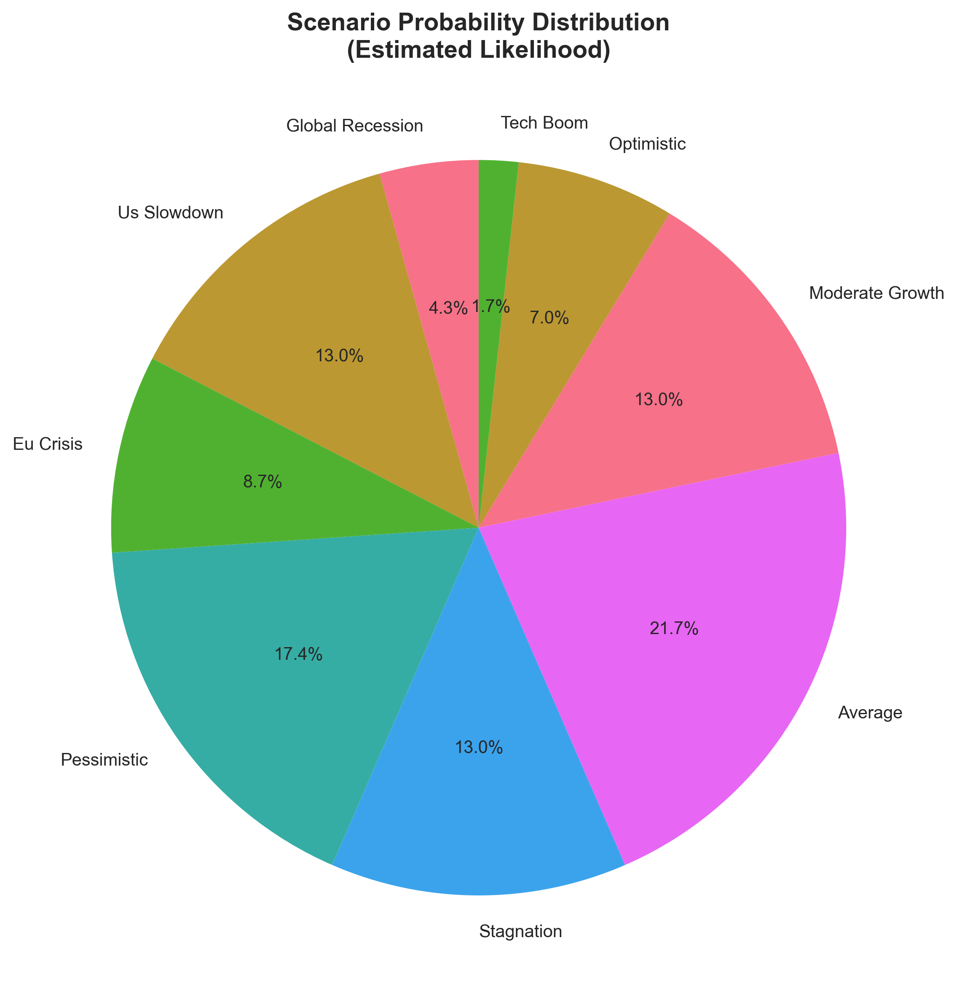
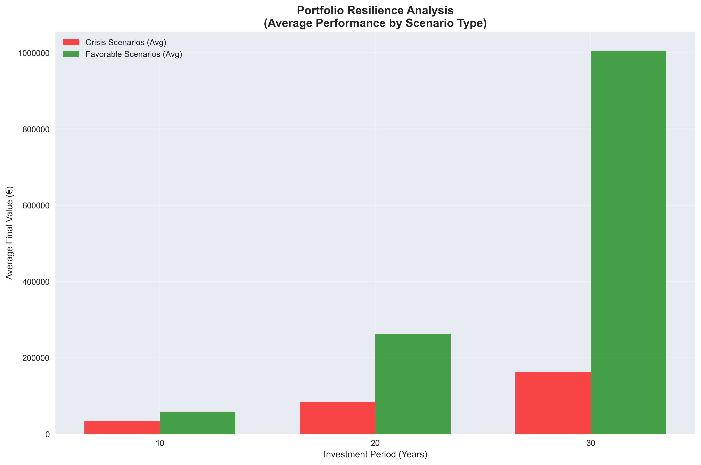
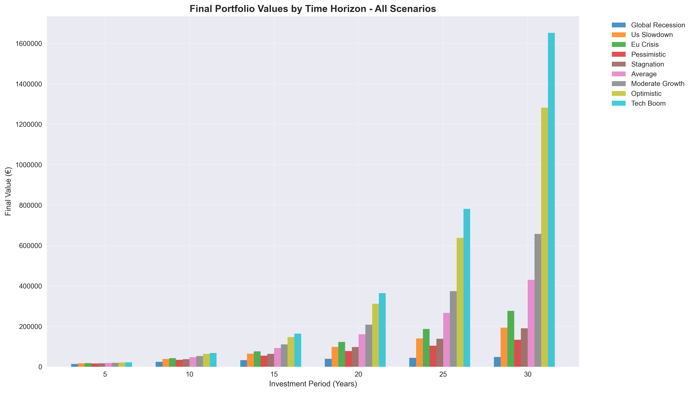
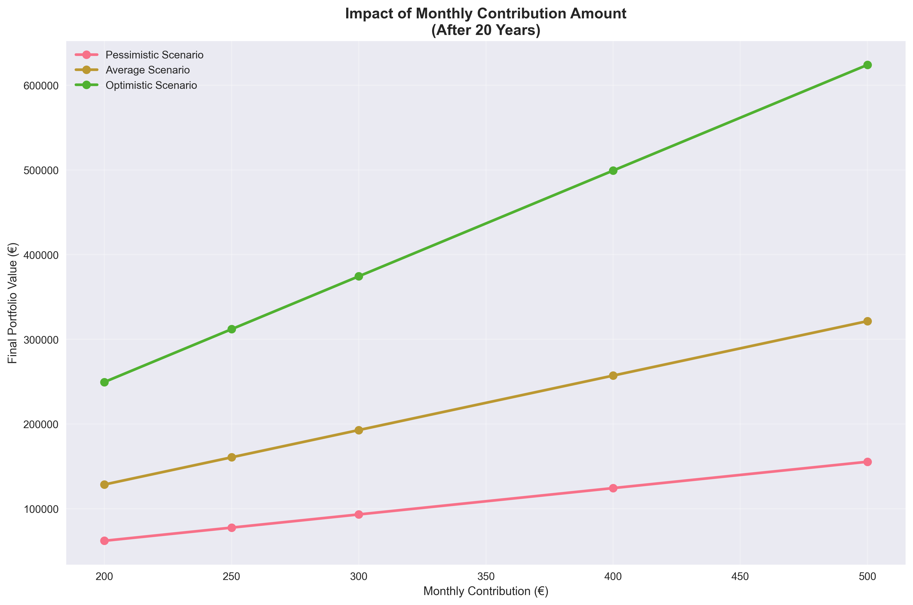

# Investment Portfolio Analysis - Geopolitical & Economic Scenarios

## Overview

This Python-based investment analysis tool provides comprehensive scenario modeling for a diversified equity portfolio with geographic allocation. The tool analyzes various economic and geopolitical scenarios to help investors understand potential outcomes over different time horizons.

## Portfolio Composition

**Asset Allocation:**
- 50% S&P 500 ETF (US Market Exposure)
- 30% STOXX Global Dividend 100 (Global Dividend Focus)
- 20% STOXX Europe 600 ETF (European Market Exposure)

**Investment Parameters:**
- Monthly Contribution: €250
- Portfolio Type: 100% Equity with Geographic Diversification
- Time Horizons: 5, 10, 15, 20, 25, and 30 years

## Economic Scenarios Analyzed

### Crisis Scenarios
1. **Global Recession** - Global economic recession with significant market downturns across all regions
2. **US Slowdown** - US economic slowdown while Europe remains relatively strong
3. **EU Crisis** - European economic crisis with capital flight to US markets

### Conservative Scenarios
4. **Pessimistic** - Prolonged bear market with low growth across all regions
5. **Stagnation** - Economic stagnation with minimal growth and inflation concerns

### Normal Scenarios
6. **Average** - Historical average returns with normal economic cycles
7. **Moderate Growth** - Moderate economic growth with stable geopolitical environment

### Optimistic Scenarios
8. **Optimistic** - Strong bull market with technological innovation and growth
9. **Tech Boom** - Technology-driven boom similar to late 1990s or 2010s

## Key Features

- **Compound Growth Calculation** with monthly contributions
- **Geopolitical Risk Analysis** across different regions
- **11 Detailed Visualization Charts** saved as individual PNG files
- **ROI Analysis** across multiple time horizons
- **Portfolio Resilience Assessment**
- **Asset Performance Comparison**

## Generated Visualizations

The analysis generates 11 detailed charts saved in the `individual_plots/` directory:

1. `01_portfolio_growth_30years.png` - Portfolio growth over 30 years for key scenarios
2. `02_geopolitical_impact.png` - Impact of geopolitical scenarios on portfolio value
3. `03_regional_performance.png` - Regional performance comparison by scenario
4. `04_crisis_vs_normal.png` - Distribution of portfolio values in crisis vs normal times
5. `05_roi_heatmap.png` - ROI heatmap by scenario and time horizon
6. `06_scenario_probabilities.png` - Estimated probability distribution of scenarios
7. `07_portfolio_resilience.png` - Portfolio performance in crisis vs favorable scenarios
8. `08_asset_allocation.png` - Visual representation of portfolio asset allocation
9. `09_all_scenarios_comparison.png` - Comprehensive comparison of all scenarios over 25 years
10. `10_final_values_comparison.png` - Final portfolio values by time horizon for all scenarios
11. `11_contribution_impact.png` - Impact of different monthly contribution amounts

## Usage

Run the analysis with:
```bash
python analyse.py
```

## Complete Analysis Results

### Comprehensive Investment Analysis - All Scenarios

The analysis covers 9 distinct economic and geopolitical scenarios, grouped into 4 categories:

#### Crisis Scenarios

**Global Recession Scenario**
- Description: Global recession with significant market downturns across all regions
- Expected Annual Portfolio Return: -4.7%
- Regional Returns: US: -5.0%, Global Div: -2.0%, Europe: -8.0%

| Years | Invested | Final Value | Total Gains | ROI % |
|-------|----------|-------------|-------------|-------|
| 10 | €30,000 | €23,973 | €-6,027 | -20.1% |
| 20 | €60,000 | €38,942 | €-21,058 | -35.1% |
| 30 | €90,000 | €48,289 | €-41,711 | -46.3% |

**US Slowdown Scenario**
- Description: US economic slowdown while Europe remains relatively strong
- Expected Annual Portfolio Return: 4.6%
- Regional Returns: US: 2.0%, Global Div: 6.0%, Europe: 9.0%

| Years | Invested | Final Value | Total Gains | ROI % |
|-------|----------|-------------|-------------|-------|
| 10 | €30,000 | €38,001 | €8,001 | 26.7% |
| 20 | €60,000 | €98,144 | €38,144 | 63.6% |
| 30 | €90,000 | €193,332 | €103,332 | 114.8% |

**EU Crisis Scenario**
- Description: European economic crisis with capital flight to US markets
- Expected Annual Portfolio Return: 6.5%
- Regional Returns: US: 12.0%, Global Div: 3.0%, Europe: -2.0%

| Years | Invested | Final Value | Total Gains | ROI % |
|-------|----------|-------------|-------------|-------|
| 10 | €30,000 | €42,101 | €12,101 | 40.3% |
| 20 | €60,000 | €122,605 | €62,605 | 104.3% |
| 30 | €90,000 | €276,545 | €186,545 | 207.3% |

#### Conservative Scenarios

**Pessimistic Scenario**
- Description: Prolonged bear market with low growth across all regions
- Expected Annual Portfolio Return: 2.5%
- Regional Returns: US: 3.0%, Global Div: 2.0%, Europe: 2.0%

| Years | Invested | Final Value | Total Gains | ROI % |
|-------|----------|-------------|-------------|-------|
| 10 | €30,000 | €34,043 | €4,043 | 13.5% |
| 20 | €60,000 | €77,744 | €17,744 | 29.6% |
| 30 | €90,000 | €133,842 | €43,842 | 48.7% |

**Stagnation Scenario**
- Description: Economic stagnation with minimal growth and inflation concerns
- Expected Annual Portfolio Return: 4.5%
- Regional Returns: US: 5.0%, Global Div: 4.0%, Europe: 4.0%

| Years | Invested | Final Value | Total Gains | ROI % |
|-------|----------|-------------|-------------|-------|
| 10 | €30,000 | €37,800 | €7,800 | 26.0% |
| 20 | €60,000 | €97,031 | €37,031 | 61.7% |
| 30 | €90,000 | €189,847 | €99,847 | 110.9% |

#### Normal Scenarios

**Average Scenario**
- Description: Historical average returns with normal economic cycles
- Expected Annual Portfolio Return: 8.7%
- Regional Returns: US: 10.0%, Global Div: 7.0%, Europe: 8.0%

| Years | Invested | Final Value | Total Gains | ROI % |
|-------|----------|-------------|-------------|-------|
| 10 | €30,000 | €47,567 | €17,567 | 58.6% |
| 20 | €60,000 | €160,748 | €100,748 | 167.9% |
| 30 | €90,000 | €430,055 | €340,055 | 377.8% |

**Moderate Growth Scenario**
- Description: Moderate economic growth with stable geopolitical environment
- Expected Annual Portfolio Return: 10.7%
- Regional Returns: US: 12.0%, Global Div: 9.0%, Europe: 10.0%

| Years | Invested | Final Value | Total Gains | ROI % |
|-------|----------|-------------|-------------|-------|
| 10 | €30,000 | €53,316 | €23,316 | 77.7% |
| 20 | €60,000 | €208,015 | €148,015 | 246.7% |
| 30 | €90,000 | €656,889 | €566,889 | 629.9% |

#### Optimistic Scenarios

**Optimistic Scenario**
- Description: Strong bull market with technological innovation and growth
- Expected Annual Portfolio Return: 13.7%
- Regional Returns: US: 15.0%, Global Div: 12.0%, Europe: 13.0%

| Years | Invested | Final Value | Total Gains | ROI % |
|-------|----------|-------------|-------------|-------|
| 10 | €30,000 | €63,611 | €33,611 | 112.0% |
| 20 | €60,000 | €312,010 | €252,010 | 420.0% |
| 30 | €90,000 | €1,281,986 | €1,191,986 | 1324.4% |

**Tech Boom Scenario**
- Description: Technology-driven boom similar to late 1990s or 2010s
- Expected Annual Portfolio Return: 14.8%
- Regional Returns: US: 18.0%, Global Div: 10.0%, Europe: 14.0%

| Years | Invested | Final Value | Total Gains | ROI % |
|-------|----------|-------------|-------------|-------|
| 10 | €30,000 | €67,973 | €37,973 | 126.6% |
| 20 | €60,000 | €363,886 | €303,886 | 506.5% |
| 30 | €90,000 | €1,652,102 | €1,562,102 | 1735.7% |

### 30-Year Investment Outcomes Summary (€250/month)

| Scenario | Final Value | Total Gains | ROI % |
|----------|-------------|-------------|-------|
| Global Recession | €48,289 | €-41,711 | -46.3% |
| Pessimistic | €133,842 | €43,842 | 48.7% |
| Average | €430,055 | €340,055 | 377.8% |
| Optimistic | €1,281,986 | €1,191,986 | 1324.4% |
| Tech Boom | €1,652,102 | €1,562,102 | 1735.7% |

### 20-Year Geopolitical Impact Analysis

**Base Case (Average Scenario): €160,748**

| Risk Scenario | Impact | Final Value |
|---------------|--------|-------------|
| Global Recession | -75.8% | €38,942 |
| US Slowdown | -38.9% | €98,144 |
| EU Crisis | -23.7% | €122,605 |
| Stagnation | -39.6% | €97,031 |

### Geopolitical Risk Analysis

#### Regional Exposure Risk Assessment
- **US Market Exposure (S&P 500):** 50%
- **European Market Exposure (STOXX EU 600):** 20% 
- **Global Dividend Exposure (STOXX Div 100):** 30%

#### Scenario Impact Analysis (20-year investment)

**Base Case (Average Scenario): €160,748**

| Risk Scenario | Impact vs Base Case | Final Value | Percentage Impact |
|---------------|--------------------|-----------|--------------------|
| Global economic recession | -75.8% impact | €38,942 | Severe downturn |
| US economic slowdown | -38.9% impact | €98,144 | Moderate impact |
| European economic crisis | -23.7% impact | €122,605 | Limited impact |
| Prolonged economic stagnation | -39.6% impact | €97,031 | Moderate impact |

#### Diversification Benefits
- Geographic diversification reduces single-country risk
- Dividend-focused allocation provides defensive characteristics  
- Multi-region exposure helps in regional crisis scenarios

### Individual Asset Performance Analysis (20 years)

This analysis shows how each component of the portfolio performs individually across different scenarios:

#### Global Recession Scenario
- S&P 500 ETF (50%): €18,987 (invested: €30,000)
- STOXX Global Div 100 (30%): €14,846 (invested: €18,000)  
- STOXX Europe 600 (20%): €5,994 (invested: €12,000)
- **Total Portfolio: €39,826**

#### US Slowdown Scenario  
- S&P 500 ETF (50%): €36,850 (invested: €30,000)
- STOXX Global Div 100 (30%): €34,653 (invested: €18,000)
- STOXX Europe 600 (20%): €33,394 (invested: €12,000)
- **Total Portfolio: €104,897**

#### EU Crisis Scenario
- S&P 500 ETF (50%): €123,657 (invested: €30,000)
- STOXX Global Div 100 (30%): €24,623 (invested: €18,000)
- STOXX Europe 600 (20%): €9,897 (invested: €12,000)
- **Total Portfolio: €158,177**

#### Average Scenario
- S&P 500 ETF (50%): €94,921 (invested: €30,000)
- STOXX Global Div 100 (30%): €39,069 (invested: €18,000)
- STOXX Europe 600 (20%): €29,451 (invested: €12,000)
- **Total Portfolio: €163,442**

#### Optimistic Scenario
- S&P 500 ETF (50%): €187,155 (invested: €30,000)
- STOXX Global Div 100 (30%): €74,194 (invested: €18,000)
- STOXX Europe 600 (20%): €56,662 (invested: €12,000)
- **Total Portfolio: €318,011**

#### Tech Boom Scenario
- S&P 500 ETF (50%): €288,607 (invested: €30,000)
- STOXX Global Div 100 (30%): €56,953 (invested: €18,000)
- STOXX Europe 600 (20%): €65,058 (invested: €12,000)
- **Total Portfolio: €410,618**

## Detailed Graph Analysis

The analysis generates 11 comprehensive visualization charts. Here's what each graph reveals:

### 1. Portfolio Growth Over 30 Years (`01_portfolio_growth_30years.png`)



**Key Insights:**
- Shows dramatic divergence between scenarios over time
- Compares 5 key scenarios: Global Recession, Pessimistic, Average, Optimistic, and Tech Boom
- Includes "Total Invested" baseline (gray dashed line) showing €90,000 after 30 years
- Demonstrates power of compound growth in favorable scenarios
- Shows resilience even in crisis scenarios over long timeframes

### 2. Geopolitical Impact Analysis (`02_geopolitical_impact.png`)



**Key Insights:**
- Compares 4 geopolitical scenarios after 20 years
- Bar chart format makes impact differences clear
- EU Crisis performs better than US Slowdown due to portfolio's US-heavy allocation
- Global Recession shows most severe impact across all regions
- Values clearly labeled on each bar for precise comparison

### 3. Regional Performance Comparison (`03_regional_performance.png`)



**Key Insights:**
- Shows annual returns by region for different scenarios
- Demonstrates how geopolitical events affect different markets
- EU Crisis: US markets benefit (+12%) while Europe suffers (-2%)
- US Slowdown: Europe outperforms (+9%) while US struggles (+2%)
- Highlights importance of geographic diversification

### 4. Crisis vs Normal Times (`04_crisis_vs_normal.png`)



**Key Insights:**
- Box plot showing distribution of outcomes after 15 years
- Clear visual separation between crisis and normal scenario outcomes
- Shows median, quartiles, and range for each scenario type
- Demonstrates portfolio's defensive characteristics during crises
- Normal scenarios show higher returns with greater variability

### 5. ROI Heatmap (`05_roi_heatmap.png`)


**Key Insights:**
- Color-coded matrix showing ROI% across all scenarios and time horizons
- Green indicates positive returns, red indicates negative returns
- Shows how time horizon dramatically improves outcomes
- Even pessimistic scenarios turn positive with longer time frames
- Tech Boom scenario shows exceptional returns across all periods

### 6. Scenario Probability Distribution (`06_scenario_probabilities.png`)



**Key Insights:**
- Pie chart showing estimated likelihood of each scenario
- Average scenario most likely (25%)
- Crisis scenarios combined represent significant probability (30%)
- Extreme scenarios (Global Recession, Tech Boom) are rare but impactful
- Helps set realistic expectations for portfolio planning

### 7. Portfolio Resilience Analysis (`07_portfolio_resilience.png`)



**Key Insights:**
- Compares average performance of crisis vs favorable scenarios
- Shows portfolio's defensive characteristics
- Gap between crisis and favorable scenarios narrows with longer time horizons
- Demonstrates value of staying invested during difficult periods
- Crisis scenarios still show positive absolute returns over long term

### 8. Asset Allocation Visualization (`08_asset_allocation.png`)


**Key Insights:**
- Clear pie chart showing portfolio composition
- 50% S&P 500 provides growth engine
- 30% Global Dividend focus adds stability
- 20% European exposure provides geographic diversification
- Balanced approach between growth and income

### 9. All Scenarios Comparison (`09_all_scenarios_comparison.png`)


**Key Insights:**
- Comprehensive view of all 9 scenarios over 25 years
- Monte Carlo-style visualization with varying line thickness and transparency
- Shows full range of potential outcomes
- Demonstrates scenario clustering by category
- Illustrates impact of compound growth over time

### 10. Final Values by Time Horizon (`10_final_values_comparison.png`)



**Key Insights:**
- Bar chart comparing all scenarios across different time periods
- Shows exponential growth pattern in favorable scenarios
- Demonstrates how longer time horizons favor equity investing
- Color-coded by scenario for easy identification
- Reveals dramatic differences between best and worst cases

### 11. Monthly Contribution Impact (`11_contribution_impact.png`)



**Key Insights:**
- Shows effect of different monthly contribution amounts (€200-€500)
- Tested across Pessimistic, Average, and Optimistic scenarios
- Linear relationship between contributions and final values
- Higher contributions provide proportionally higher returns
- Demonstrates scalability of the investment strategy

## Key Strategic Insights

### Extreme Scenario Analysis (30 years)
- **Range of Outcomes:** €1,603,813 (from Global Recession €48,289 to Tech Boom €1,652,102)
- **Average Case:** €430,055 provides solid foundation for planning
- **Crisis Resilience:** Even worst-case scenario preserves significant capital
- **Upside Potential:** Tech boom scenario shows exceptional wealth creation

### Regional Risk Mitigation
- **US Slowdown Impact:** Portfolio drops to €98,144 (20-year)
- **EU Crisis Impact:** Portfolio reaches €122,605 (20-year)  
- **Diversification Effect:** Geographic spread reduces single-region dependency
- **Dividend Buffer:** Global dividend allocation provides stability during volatility

### Time Horizon Advantages
- **Short-term Risk:** Higher volatility in 5-10 year periods
- **Medium-term Stability:** 15-20 years show more predictable outcomes
- **Long-term Dominance:** 25-30 years heavily favor equity allocation
- **Crisis Recovery:** Extended periods allow recovery from temporary setdowns

### Investment Strategy Recommendations

Based on the comprehensive analysis across all scenarios and time horizons:

#### 1. Maintain Geographic Diversification
- **Reduces country-specific risks** - No single region dominates portfolio performance
- **Crisis protection** - When one region struggles, others may compensate
- **Opportunity capture** - Benefits from growth in any major economic region

#### 2. Consider Rebalancing During Extreme Market Conditions
- **Systematic approach** - Rebalance when allocations drift significantly from targets
- **Crisis opportunities** - Market downturns create buying opportunities
- **Profit taking** - Reduce exposure in overperforming assets during bubbles

#### 3. Dollar-Cost Averaging Benefits
- **Volatility smoothing** - Regular contributions help smooth out geopolitical volatility
- **Market timing elimination** - Removes need to predict market movements
- **Discipline maintenance** - Automated investing prevents emotional decisions

#### 4. Long-Term Perspective is Crucial
- **Crisis recovery** - All scenarios show positive outcomes over 20+ year periods
- **Compound growth** - Time amplifies the benefits of equity investing
- **Volatility reduction** - Longer periods reduce impact of short-term fluctuations

#### 5. Defensive Allocation Provides Downside Protection
- **Dividend focus** - 30% allocation to dividend stocks provides income stability
- **Bear market resilience** - Defensive characteristics help during downturns
- **Income generation** - Dividends provide cash flow even when prices decline

### Risk Management Insights

#### Crisis Scenario Planning
- **Worst case preserved capital** - Even Global Recession scenario maintains significant value
- **Recovery potential** - Extended time horizons allow recovery from temporary setbacks
- **Diversification effectiveness** - Portfolio performs better than individual regional exposure

#### Opportunity Cost Analysis
- **Conservative vs Growth** - Balance between safety and growth potential
- **Time horizon matching** - Longer horizons justify higher equity allocation
- **Risk tolerance** - Individual circumstances should guide scenario planning

## Executive Summary

This comprehensive investment analysis demonstrates that a geographically diversified equity portfolio with regular monthly contributions of €250 can produce a wide range of outcomes depending on economic and geopolitical conditions over the next 30 years.

### Key Findings:

**Range of 30-Year Outcomes:** €48,289 (Global Recession) to €1,652,102 (Tech Boom)

**Base Case Scenario:** €430,055 after 30 years (377.8% ROI)

**Crisis Resilience:** Even severe downturns preserve significant capital over long periods

**Geographic Benefits:** Regional diversification helps mitigate country-specific risks

**Time Advantage:** Longer investment horizons strongly favor equity allocation

### Strategic Takeaways:

1. **Start Early and Stay Consistent** - Regular contributions and long time horizons are the most important factors
2. **Diversify Globally** - No single region should dominate your portfolio
3. **Plan for Multiple Scenarios** - Understanding the range of outcomes helps set realistic expectations
4. **Focus on Time, Not Timing** - Long-term perspective beats trying to time markets
5. **Maintain Discipline** - Stick to your allocation through various market cycles

*This analysis provides educational insights into portfolio performance under various economic scenarios. Past performance does not guarantee future results. Please consult with financial advisors for personalized investment advice.*